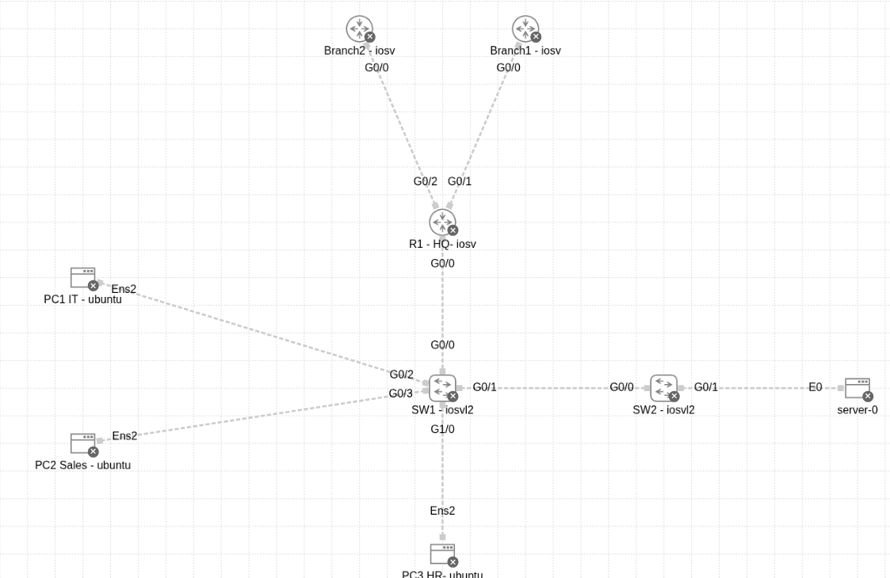
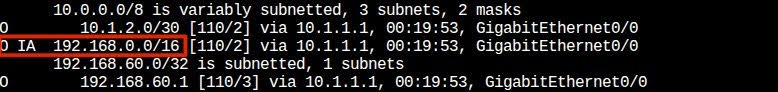
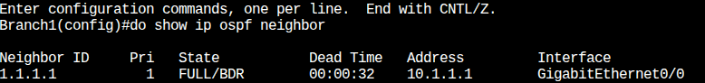
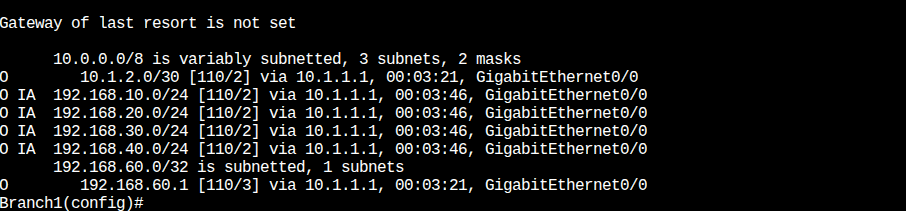
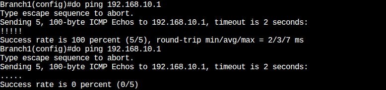

<h1 align="center"> 🏢 Enterprise Network Project</h1>
<h2 align="center">Secure LAN to OSPF Multi-Branch WAN</h2>

<h2>📋 نظرة عامة (Project Overview)</h2>

يمثل هذا المشروع تطورًا عمليًا ومتدرجًا لبنية تحتية شبكية لمؤسسة متوسطة الحجم.
يُعد هذا العمل امتدادًا مباشرًا لمشروعين سابقين ركّزا على:

<ul>
<li>تأمين الشبكة المحلية (Secure LAN – Layer 2 & Layer 3 Hardening)</li>
<li>بناء أساس شبكي مستقر وقابل للتوسع</li>
</ul>

ثم انتقل المشروع في هذه المرحلة إلى ربط الفروع (Remote Branches) بالمقر الرئيسي (HQ)
عبر شبكة WAN باستخدام بروتوكول التوجيه OSPF Multi-Area.

الهدف الأساسي هو تحقيق توازن عملي بين:

<ul>
<li>الأداء (Performance)</li>
<li>الأمان (Security)</li>
<li>استمرارية العمل (High Availability & Fault Isolation)</li>
</ul>

<h2>🗺️ مخطط الشبكة والأجهزة (Topology & Devices)</h2>

يعتمد التصميم على هيكلية Hub-and-Spoke:

<ul>
<li>
<strong>HQ Router:</strong> 
يعمل كمركز الشبكة (Hub) ويمثل نقطة الربط الأساسية.
</li>
<li>
<strong>Branch Routers:</strong> 
تتصل الفروع بالمقر الرئيسي فقط (Spokes)، دون وجود اتصال مباشر بينها.
</li>
</ul>

📌 مخطط التوبولوجي المستخدم في المشروع:

  

<h3>2️⃣ جدول العناوين (IP Addressing Table)</h3>

تم تخطيط العناوين بعناية لضمان:

<ul>
<li>عدم التعارض</li>
<li>سهولة التلخيص (Route Summarization)</li>
<li>وضوح الفصل بين WAN و LAN</li>
</ul>

<table border="1" cellpadding="8" cellspacing="0">
<tr>
<th>Device</th>
<th>Interface</th>
<th>IP Address</th>
<th>Subnet Mask</th>
<th>OSPF Area</th>
<th>Description</th>
</tr>

<tr>
<td rowspan="3">HQ (R1)</td>
<td>G0/1</td>
<td>10.1.1.1</td>
<td>/30</td>
<td>Area 1</td>
<td>WAN Link to Branch 1</td>
</tr>
<tr>
<td>G0/2</td>
<td>10.1.2.1</td>
<td>/30</td>
<td>Area 1</td>
<td>WAN Link to Branch 2</td>
</tr>
<tr>
<td>VLANs</td>
<td>192.168.10.0</td>
<td>/24</td>
<td>Area 0</td>
<td>Internal HQ Networks</td>
</tr>

<tr>
<td rowspan="2">Branch 1</td>
<td>G0/0</td>
<td>10.1.1.2</td>
<td>/30</td>
<td>Area 1</td>
<td>Uplink to HQ</td>
</tr>
<tr>
<td>Loopback0</td>
<td>192.168.50.1</td>
<td>/24</td>
<td>Area 1</td>
<td>Simulated Branch LAN</td>
</tr>

<tr>
<td rowspan="2">Branch 2</td>
<td>G0/0</td>
<td>10.1.2.2</td>
<td>/30</td>
<td>Area 1</td>
<td>Uplink to HQ</td>
</tr>
<tr>
<td>Loopback0</td>
<td>192.168.60.1</td>
<td>/24</td>
<td>Area 1</td>
<td>Simulated Branch LAN</td>
</tr>
</table>

<h2>⚙️ قرارات التصميم والتقنيات (Design Choices & Technologies)</h2>

<h3>1️⃣ بروتوكول OSPF (Open Shortest Path First)</h3>

<ul>
<li>سرعة التكيف مع التغييرات (Fast Convergence)</li>
<li>مناسب للشبكات المؤسسية</li>
<li>يدعم التصميم متعدد المناطق (Multi-Area)</li>
</ul>

<h4>🔹 تصميم Multi-Area</h4>
<ul>
<li>
السبب: تعريف واجهات WAN في المقر على Area 0 بينما الفروع على Area 1.
<li/>
<li>
Area 1: مخصصة لروابط WAN وشبكات الفروع
</li>
</ul>

🎯 الهدف: تقليل حجم LSAs، وتحقيق عزل الأعطال داخل كل منطقة.

<h3>2️⃣ تلخيص المسارات (Route Summarization)</h3>

تم تلخيص شبكات المقر الرئيسي إلى المسار التالي:

<pre>192.168.0.0 /16</pre>

📷 نتيجة التلخيص بعد التطبيق:

  

<h3>3️⃣ الواجهات الخاملة (Passive Interfaces)</h3>

<pre>
passive-interface default
</pre>

🔐 السبب:

<ul>
<li>منع إرسال OSPF Hello إلى شبكات المستخدمين</li>
<li>تقليل سطح الهجوم</li>
<li>منع اكتشاف التبولوجي من أجهزة غير مصرح لها</li>
</ul>

<h2>🛠️ التحديات وحل المشاكل (Challenges & Troubleshooting)</h2>

<h3>🔴 1️⃣ Area ID Mismatch</h3>

<pre>
%OSPF-4-ERRRCV: Received invalid packet: mismatched area ID
</pre>

<ul>

<il>

السبب: تعريف واجهات WAN في المقر على Area 0 بينما الفروع على Area 1.

<il/>

<il>

الحل: إعادة ضبط جميع روابط WAN لتكون ضمن Area 1.

</li>
</ul>

<h3>🔴 2️⃣ أوامر أمان غير مناسبة</h3>

<pre>
ip dhcp snooping trust
</pre>

السبب: الأمر خاص بالسويتشات فقط. 
الحل: تطبيقه فقط على سويتشات التوزيع.

<h3>🔴 3️⃣ أخطاء نحوية أثناء التنفيذ</h3>

السبب: تنفيذ أوامر اختبار داخل Configuration Mode. 
الحل: استخدام الأمر <code>do</code>.

<h2>📸 التوثيق </h2>

<h3>1️⃣ OSPF Neighbor Adjacency (State: FULL)</h3>

  

<h3>2️⃣ مقارنة جدول التوجيه (Route Summarization Comparison)</h3>

يوضح هذا القسم كيف أدى التلخيص إلى تحسين جدول التوجيه في الفروع.

<h4>- قبل التلخيص (Before Summarization)</h4>

نلاحظ ظهور جميع الشبكات الفرعية (10, 20, 30, 40) بشكل منفصل، وهاذا يجعل الجدول ضخم .

  

<h4>ب- بعد التلخيص (After Summarization)</h4>

تم دمج جميع الشبكات السابقة في مسار واحد (192.168.0.0/16) كما يظهر في المربع الأحمر.

  

<h3>3️⃣ اختبار الاتصال الأساسي (Ping Baseline)</h3>

  

<h3>4️⃣ اختبار انقطاع الفرع الأول</h3>

  

<h3>5️⃣ استمرار الخدمة في الفرع الثاني</h3>

  

📌 يثبت هذا استقلالية الفروع وعدم تأثرها بأعطال فروع أخرى.

<h2>📄 مقتطفات من الإعدادات (Configuration Snippets)</h2>

<h3>HQ Router (ABR Configuration)</h3>

<pre>
router ospf 1
router-id 1.1.1.1

network 10.1.1.0 0.0.0.3 area 1
network 10.1.2.0 0.0.0.3 area 1
network 192.168.10.0 0.0.0.255 area 0

area 0 range 192.168.0.0 255.255.0.0

passive-interface default
no passive-interface GigabitEthernet0/1
no passive-interface GigabitEthernet0/2
</pre>

<h3>Branch Router (Example)</h3>

<pre>
router ospf 1
router-id 2.2.2.2

network 10.1.1.0 0.0.0.3 area 1
network 192.168.50.0 0.0.0.255 area 1
</pre>

<h2>📂 محتويات المستودع (Repository Contents)</h2>

<ul>
<li>HQ-Config.txt — إعدادات راوتر المقر</li>
<li>Branch1-Config.txt — إعدادات الفرع الأول</li>
<li>Branch2-Config.txt — إعدادات الفرع الثاني</li>

</ul>

Created using Cisco Modeling Labs (CML)

